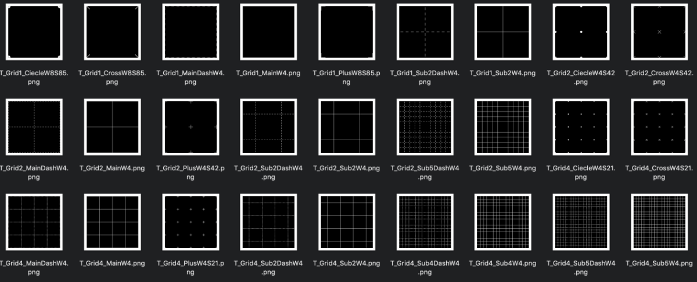

# GridUnitsSVG

## Introduction
This is a collection of mask images for procedural generation of grid textures and materials.  
Mask images are generated as svg file using [Processing](https://processing.org).  
And a large amount of mask images are converted to png files via [CairoSVG](https://cairosvg.org/).  
How to convert them is summarized [this repository](https://github.com/jnphgs/BatchSVGtoPNG).

## Dependency
- [Processing 3.5.3](https://processing.org/)
